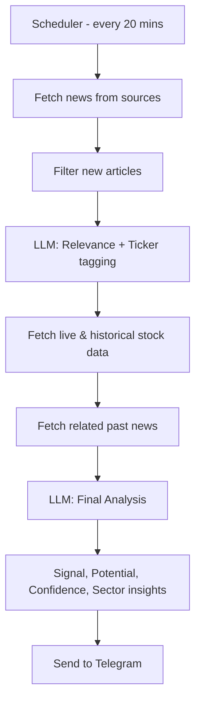

# 📈 Stock News Analysis & Market Signal Generator

An automated pipeline for **real-time stock market news analysis**, powered by a combination of **web scraping, RSS feeds, Yahoo Finance data, and GPT-based analysis**.  
This system identifies impactful stock-related news for the Indian market, enriches it with live & historical data, and sends actionable insights directly to Telegram.

---

## 🚀 Features

- **Automated Scheduling**  
  - Runs every 20 minutes via a scheduler.
  - Fully hands-off once deployed.

- **Multi-Source News Aggregation**  
  - 2 web-scraped sources.
  - 1 RSS feed.
  - Filters only **new** articles since the last run.

- **Market Relevance Filtering (LLM)**  
  - Uses a language model to determine if news is relevant to:
    - Indian stock market
    - Specific companies
  - Automatically attaches **relevant stock tickers**.

- **Data Enrichment**  
  - Fetches live and historical stock price data from **Yahoo Finance API**.
  - Retrieves related past news for additional context.

- **Advanced GPT Analysis**  
  - **Signal Analysis** — Detects potential bullish/bearish signals.
  - **Potential Impact Analysis** — Estimates likely market effect.
  - **Confidence Analysis** — Rates reliability of the signal.
  - **Sector Analysis** — Identifies affected market sectors.

- **Instant Delivery to Telegram**  
  - Clean, formatted analysis messages delivered in near real-time.

---

## 🛠 Tech Stack

| Component                | Technology Used |
|--------------------------|-----------------|
| Scheduler                | *`APScheduler`* |
| News Scraping            | *`BeautifulSoup`, `Selenium`* |
| RSS Parsing              | *`feedparser`* |
| LLM Orchestration        | LangChain |
| LLM Processing           | *`gpt-4o-mini`* (OpenAI API)|
| Embedding Model          | *`text-embedding-3-small`* (OpenAI API) |
| Stock Data               | Yahoo Finance API (`yfinance`) |
| Messaging                | Telegram Bot |
| Vector Store             | Faiss Vector Store |
| Retriever                | Time Weighted Vector Store Retriever |

---

## ⚙️ Workflow


---

## 📦 Installation & Setup

Follow these steps to get the project running locally.

---

### 1️⃣ Clone the Repository

```bash
git clone https://github.com/tarandeepkhurana/Stock_News_Fetcher.git
cd Stock_News_Fetcher
```

### 2️⃣ Create a Virtual Environment
```bash
python -m venv venv
source venv/bin/activate   # For Linux/Mac
venv\Scripts\activate      # For Windows
```

### 3️⃣ Install Dependencies
```bash
pip install -r requirements.txt
```

### 4️⃣ Configure Environment Variables
Create a .env file in the project root with the following:
- OPENAI_API_KEY = 'your_key'
- BOT_TOKEN = 'your_token'
- CHAT_ID = 'your_chat_id'<br><br>
**Important**: Ensure .env is listed in .gitignore so it’s never pushed to GitHub.

### 5️⃣ Run the Application
```bash
python main.py
```
